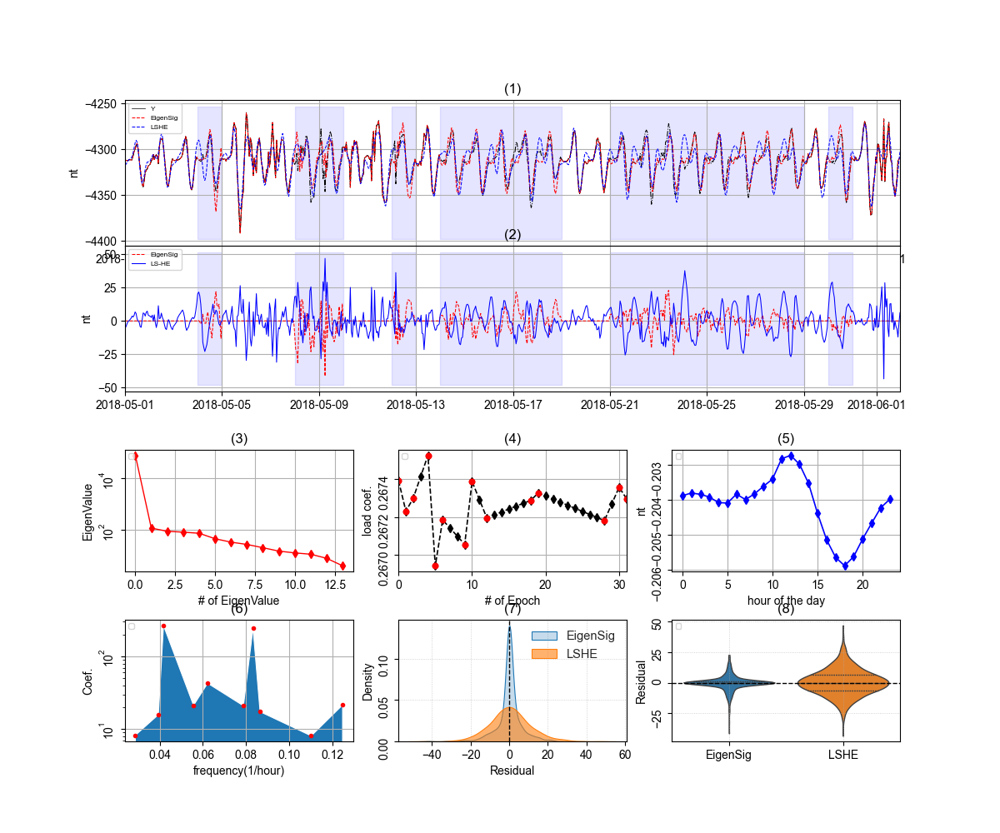
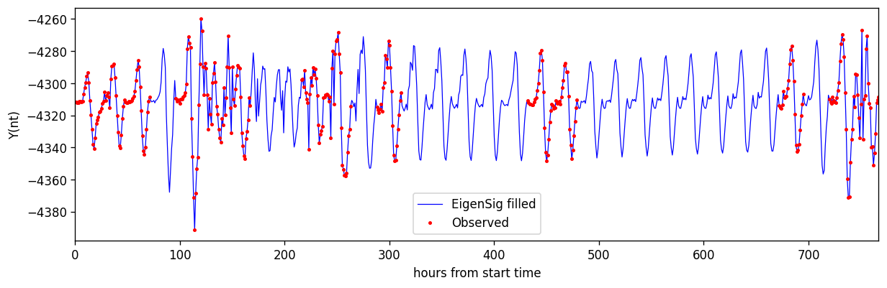

# **PyGap: Data gap filling using Eigenspace and Fourier Series**


## 1. Purpose of PyGap
PyGap implements EigenSig and LSHE for data gap filling or further been adapted for data quality control, anomaly detection and separation. For example, Figure_PyGap.py created following figure.

In the Figure, 
- (1) the Y is observed geomagnetic records, strip domains are removed to create synthetic gaps, filled data gaps using PyGap are labeled as EigenSig and LSHE; 
- (2) Residuals of the two models included in the PyGap; 
- (3) Singular spectrum used in EigenSig; 
- (4) Known (red) and traced (black) coordinates in the eigenspace; 
- (5) The first basis in the Eigenspace; 
- (6) Detected frequency components in LSHE; 
- (7) statistical histograms of residuals; 
- (8) statistical violin plots of residuals.    

### 1.1 *EigenSig* 

The **EigenSig** methodology [^2], an eigenspace-based approach for filling data gaps, separating signals, and analyzing structural patterns in spatio-temporal datasets. Unlike harmonic approaches that rely on predefined Fourier components, EigenSig is entirely **data-driven**, extracting dominant structures directly from the observations. This makes it particularly suitable for geophysical, environmental, and climate datasets that contain irregular sampling, long data gaps, transient events, and non-stationary behavior.

Methods can be find in DemoEigenSig.ipynb or paper [^2] for details.
 

### 1.2 *LSHE*

LSHE (Least Squares Harmonic Estimation) [^1] is a spectral-analysis and signal-reconstruction method implemented in PyGap for filling missing observations, detecting significant frequencies (Amiri-Simkooei, 2007). Originally developed for irregularly sampled geodetic time series, LSHE models an observed signal as a combination of trend (first order polynomial), harmonic components (Fourier series), and stochastic noise (white or color noises). Because it operates directly on irregular observations, it is well suited to geophysical and environmental datasets where continuous data gaps are common. 

Methods can be find in DemoLSHE.ipynb or paper[^1] for details.

## 2. Installation

### 2.1 copy subfoler 
Copy subfoler (pyGap) and paste it into your working folder, then import the PyGap package is the simplest way to use it.


### 2.2 pip install 

download XXX, using following pip to install the package to your Python lib folder. Then call it following the demonstration examples.

### 2.3 test 
PyGap is tested using folowing codes.
see
 - ./tests/test_imports.py
 - ./tests/test_datasamples.py
 - ./tests/test_EigenSig.py

## 3. Quick Start & Examples


### 3.1 simple Sequential data
This demonstrate data is extratced from the simulated data in DemoEigenSig where the simulated data gaps are dumped to be as pure asc data other than mixed original data with synthetic data gap. Compare this example with the DemoEigenSig data in Pandas can help in understanding the Data structure used in PyGap.

Inside PyGap, it is based on sequntial data that for known epochs $t[N]$ ($N$ is not evenly sampled), the observation is presented as $y_{n,m}$ EigenSig uses $t[N]$ and $y_{n,m}$ to fit an EigenSig object. We will create a series of $T[m]$  
where $(T[0] =t[0]$ and $T[-1] =t[-1])$ to assure interpolation. $M$ is desired number of point to be interpolated.

For example, if we had 14 observed epochs, the epoch number is:
 [0,1,2,4,5,6,9,10,12,18,19,28,30,31] (such as days from the starting days). 

We need to fill days at gap days ([3,7,8,11,13,14,15,16,17,20,21,22,23,24,25,26,27,29]), so, we create T=[0,1,2,3,...,31] to be used for PyGap. The observed data looks like.

In above figure, the first column is the $t[N]$, other than the first column in every line is the observations for that epoch ($m$=24). following codes import this data and fill data gaps in $T[...].
```python
import numpy as np
import matplotlib.pyplot as plt
from pathlib import Path
import sys
project_root = Path.cwd().parent
sys.path.insert(0, str(project_root))

#step 1: import the PyGap
from PyGap import dataSamples as ds
from PyGap import EigenSig
from PyGap import LSHE
from PyGap import charts

#step 2 load sequential data
obs = np.loadtxt('eigenData_example.csv', delimiter=',',skiprows=1)
t = obs[:,0]
y= obs[:,1:].flatten()  #stack epochs as one vector
T= np.array([x for x in range(int(t[0]),int(t[-1])+1)])

#step 3: construct gap filling object, fit model using data with gaps. then filling (predict) gaps in the data. 
gf = EigenSig.GapFilling()      
gf.fit(t,y)

Y = gf.predict(T, inter1D='slinear', filtStr='0:')  

#Y_m has the same structure as the input eigenData_example.csv but have every epochs filled,
# it can be save to disk.
#Y_m = np.column_stack((T, Y.reshape(-1,24)))
#np.savetxt('output.txt', Y_m, fmt='%12.4f', delimiter=',')

#plot data
plt.plot((t[:, np.newaxis] * 24 + np.arange(24)).flatten(),y,'or',markersize=2,label='Observed')
plt.plot((T[:, np.newaxis] * 24 + np.arange(24)).flatten(),Y,'--',label='EigenSig', lw=0.75)
plt.legend()  
```
This will create following charts.


### 3.2 **EigenSig**

see 
[Open notebook](demoLSHE.ipynb) 

which demonstrate DataFrame version of previous example.

### 3.3 **LSHE**

see
[Open notebook](demoEigenSig.ipynb) 
which demonstrate DataFrame version showing how to use LSHE

### 3.4 msc  

See 
- [Open notebook](data_prepare.ipynb) 
- EigenData_example.csv
- EigenData_example.xlsx 
- ./data/*.*  inside PyGap package

## 4. API Reference

See 

./docs/API.md 
or go to HTML documents

HTML/index.html

for detailed API documentation.

## 5. HTML documents

included in folder HTML/api.html

## 6. Citation
 Li, Q. and Liu, X. 2026, PyGap: Data gap filling using Eigenspace and Fourier Series, JOSS. 

## 7. License

Unless otherwise noted, the PyGap is covered under Crown Copyright, Government of Canada, and released under the MIT License. See the LICENSE file for details.

## 8. Acknowledgement
This research was supported by the Critical Mineral Geoscience and Data (CMGD) Program and Deep
Earth Modeling in Targeted Geoscience Initiative 7 (TGI-7) program of the Geological Survey of
Canada, Natural Resources Canada.

## 9. Referrences
[1]: Amiri-Simkooei, A.R. 2007. Least-squares variance component estimation: theory and GPS applications. PhD thesis, Delft University of Technology, Publication on Geodesy, 64, Netherlands Geodetic Commission, Delft.

[2]: Li, Q. and Liu, X., 2026. Gap Filling and Anomaly Separation Using Inverse Principal Components Analysis, Pure Appl. Geophys., https://doi.org/10.1007/s00024-026-04053-5.


