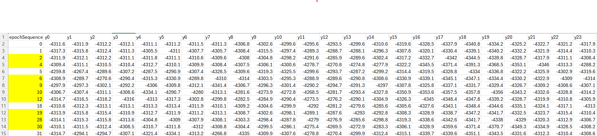

# PyGap

PyGap is a Python package is developed for data gap filling, data quality control, anomaly detection/separation.

## Features

- EigenSig anomaly detection
- LSHE analysis
- Built-in datasets
- Visualization tools

## Installation

## copy subfoler 
Copy subfolder (pyGap) and paste it into your working folder, then import the PyGap package is the simplest way to use it.
## uzip 

unzip pygap-1.0.0.tar into a subfolder, then register that subfolder in the system.

## pip install pygap-1.0.0-py3-none-any.whl

## Quick start

This demonstrate data is extratced from the simulated data in DemoEigenSig where the simulated data gaps are
dumped to be as pure asc data other than mixed original data with synthetic data gap. Compare this example with the DemoEigenSig data in Pandas can help in understanding the Data structure used in PyGap.

Inside PyGap, it is based on sequntial data that for known epochs $t[N]$ ($N$ is not evenly sampled), the observation is presented as $y_{n,m}$ EigenSig uses $t[N] and $y_{n,m}$ to fit an EigenSig object. We will create a series of $T[m]$  
where $(T[0] =t[0]$ and $T[-1] =t[-1])$ to assure interpolation. $M$ is desired number of point to be interpolated.
For example, if we had 14 observed epochs, the epoch number is [0,1,2,4,5,6,9,10,12,18,19,28,30,31] (such as days from the starting days). We need to fill days at gap days ([3,7,8,11,13,14,15,16,17,20,21,22,23,24,25,26,27,29]), so, we create T=[0,1,2,3,...,31] to be used for PyGap. The observed data looks like.

In abpve figure, the first column is the $t[N]$, other than the first column in every line is the observations for that epoch ($m$=24). following codes import this data and fill data gaps in $T[...].
```python
import numpy as np
import matplotlib.pyplot as plt
from pathlib import Path
import sys
project_root = Path.cwd().parent
sys.path.insert(0, str(project_root))

#step 1: import the PyGap
from PyGap import dataSamples as ds
from PyGap import EigenSig
from PyGap import LSHE
from PyGap import charts

#step 2 load sequential data
obs = np.loadtxt('eigenData_example.csv', delimiter=',',skiprows=1)
t = obs[:,0]
y= obs[:,1:].flatten()  #stack epochs as one vector
T= np.array([x for x in range(int(t[0]),int(t[-1])+1)])

#step 3: construct gap filling object, fit model using data with gaps. then filling (predict) gaps in the data. 
gf = EigenSig.GapFilling()      
gf.fit(t,y)

Y = gf.predict(T, inter1D='slinear', filtStr='0:')  

#Y_m has the same structure as the input eigenData_example.csv but have every epochs filled,
# it can be save to disk.
#Y_m = np.column_stack((T, Y.reshape(-1,24)))
#np.savetxt('output.txt', Y_m, fmt='%12.4f', delimiter=',')

#plot data
plt.plot((t[:, np.newaxis] * 24 + np.arange(24)).flatten(),y,'or',markersize=2,label='Observed')
plt.plot((T[:, np.newaxis] * 24 + np.arange(24)).flatten(),Y,'--',label='EigenSig', lw=0.75)
plt.legend()  
```


